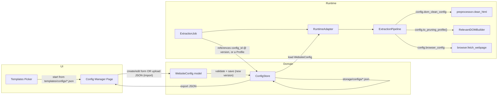
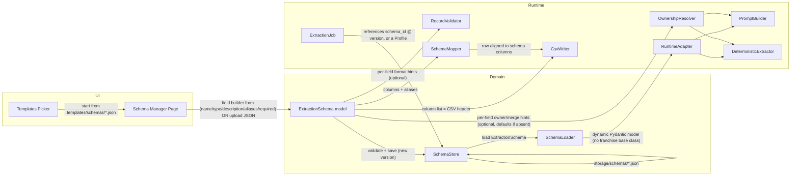
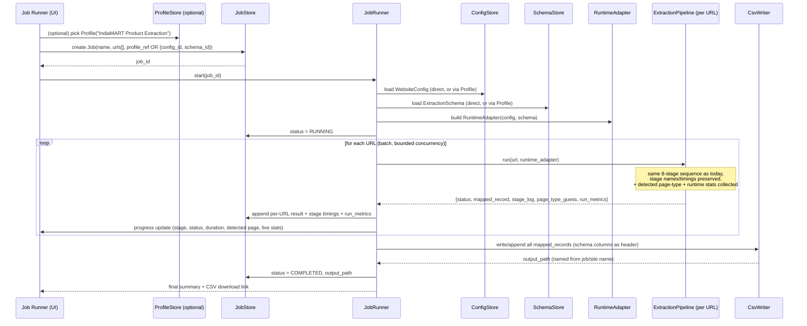

# Architecture Redesign Blueprint — Generic, UI-Driven Extraction Framework

**Status:** Milestones 1, 2, and 2.5 are implemented (see §14 for what shipped in each). This document remains the reference blueprint for what's left — Milestones 3–5 (UI, CSV output, Extraction Profiles, versioning) are still proposals, not code.

**Revision:** v3 — records what Milestones 1/2/2.5 actually built, and folds in a "Milestone 2.5" (backend hardening: service layer, job lifecycle, validation errors, `ExecutionContext`) inserted between the originally-planned Milestone 2 and Milestone 3, on review feedback that the UI should be built against a stable, already-tested backend contract rather than in parallel with it. Changes from v2:
- **Implemented, not just proposed:** `WebsiteConfig`/`ExtractionSchema`/`ExtractionJob`, `RuntimeAdapter`, `PipelineContext`, `OwnershipResolver`, `SchemaLoader.build_model()`, the `templates/` rename, and the file-backed `ConfigStore`/`SchemaStore`/`JobStore` — all as designed in v2.
- **`JobRunner` (v2's proposed class) was built, then removed** — its responsibility was absorbed into `JobService` (see below) rather than living alongside it as a second, overlapping job-orchestration abstraction.
- **New in Milestone 2.5, not in the original v2 plan:** a `services/` layer (`ConfigService`/`SchemaService`/`JobService`) as the only interface a UI is meant to call; an explicit job lifecycle (`config/job_status.py`, including a `PARTIAL` status the original proposal didn't have — needed because a batch job's URLs don't have a binary outcome); structured validation (`config/errors.py: ValidationError`, `services/errors.py: NotFoundError`/`DuplicateNameError`/`JobLifecycleError`); and `ExecutionContext` (`core/execution_context.py`), the single immutable job+adapter binding every layer of a job's execution now receives instead of separately-threaded parameters.
- Extraction Profiles, configuration versioning, and import/export (the three "added capabilities" from v2) remain **not yet implemented** — still planned for Milestone 5.

**Guiding principle (unchanged):** the engine should not know what a "franchise" is. It should only know: *render a page → clean it → decide what's relevant → extract fields described by a schema → validate → write CSV*. Everything franchise-shaped today is domain knowledge that leaked into the engine instead of staying in configuration data.

---

## 0. Current vs. Future — one-line framing

| Concept | Today | After redesign |
|---|---|---|
| Site-specific rules | Code-adjacent `adapters/<name>/config.json`, discovered by scanning a project folder and matching domain | A **Website Configuration** record, created/edited/saved through the UI (or started from a `templates/` starter), referenced by ID, assembled at runtime into a `RuntimeAdapter` |
| Output shape | `adapters/<name>/schema.json` fields, inherited from a franchise-shaped base Pydantic model | An **Extraction Schema** record (field list only, no base-class inheritance), created/edited/saved through the UI |
| Combining the two for reuse | N/A (config and schema are only ever combined implicitly, by folder) | An optional **Extraction Profile** — a named, saved bundle of `WebsiteConfig` + `ExtractionSchema` + runtime settings (e.g. "IndiaMART Product Extraction") the user can pick as a single unit |
| Unit of work | An ad-hoc `pipeline.run(url)` call from Streamlit or a `DatasetBuilder.process_urls()` batch | An **Extraction Job**: `{urls, website_config or profile, extraction_schema}` → tracked, saved, re-runnable |
| Output file | `.xlsx`, filename = schema's `dataset_name` (page-type based) | `.csv`, filename = job name / website config name |
| Field ownership (deterministic vs LLM) | Hardcoded Python dict (`core/field_strategy.py`) keyed by franchise field names | Optional, per-field metadata with a generic type-based default — most users never touch it |
| Page-type detection | Silently selects which `schemas/*.json` file to route a record into | Kept, run every time, but only ever **displayed** ("Detected Page: Product, 94%") — never selects a schema |
| Currency/phone/area formatting | Unconditionally applied to every record, assumes ₹/Lakhs/+91/sq.ft | Optional, opt-in per schema field |

---

## 1. Modules that can remain unchanged

These already operate purely on data structures passed into them (HTML, a profile object, a schema dict) and contain no franchise vocabulary. They are proof the codebase already knows how to be generic — the redesign extends that pattern everywhere, and (per feedback) touches as little of their calling convention as possible.

| Module | Why it can stay as-is |
|---|---|
| `modules/browser.py` (rendering engine itself) | Playwright orchestration — scrolling, expanding, tab discovery/merging — is driven entirely by `adapter.config["browser_config"]`/`clickable_tabs`. Because the new `RuntimeAdapter` exposes the same `.config` shape, this file needs **no interface change at all** — only its hardcoded fallback defaults change (see §5). |
| `modules/preprocessor.py` (`clean_html`, `estimate_tokens`) | Already reads its allow/remove-lists from the passed-in config object; contains no field-name assumptions. `detect_page_type()` is generic heuristic scoring and is explicitly **kept and surfaced**, not removed (see §4). |
| `modules/relevant_dom/builder.py` | Explicitly documented as "never extracts business values, never uses fixed CSS selectors" — it scores sections using whatever keyword lists a `DomainProfile` gives it. Fully reusable unchanged. |
| `modules/domain_profiles/base.py` (`DomainProfile` dataclass) | Pure data, no logic, already generic. Keeps its shape; only *where it's constructed from* changes (from `Adapter.get_profile()` to `RuntimeAdapter.get_profile()`, still ultimately built from `WebsiteConfig`). |
| `core/dom_builder.py` (`DOMBlockBuilder`) | Structural HTML→block conversion has zero domain coupling. Unchanged. |
| `core/prompt_builder.py` (`ExtractionPromptBuilder`) | Already schema-driven: it reads `extraction_fields` from whatever schema dict it's given and scores DOM blocks by keyword overlap with *unsolved* fields. Unchanged (only its schema *source* changes). |
| `modules/llm/base.py`, `factory.py`, `gemini_provider.py`, `ollama_provider.py` | The LLM abstraction layer is already provider-agnostic and schema-agnostic. No franchise coupling. Unchanged. |
| `modules/dataset_builder/detector.py` (`DuplicateDetector`) | Its logic ("scan primary-key columns for a matching row") is storage-shape-agnostic in spirit; needs a new adapter to read CSV rows instead of openpyxl cells, but the *algorithm* is unchanged and portable. |
| `modules/diagnostics/extraction_inspector.py` | Traces field presence through debug snapshot files; already schema-driven. Unchanged, just needs to be pointed at job-scoped debug folders. |
| `utils/logger.py` | Cross-cutting, no domain coupling. Unchanged. |

**Why this matters:** roughly half the engine (rendering → cleaning → pruning → block-building → prompting → LLM calling → diagnostics) is already architected the right way, and preserving the `Adapter`-shaped object as `RuntimeAdapter` (rather than replacing it with something structurally different) means this list stays this short — most of these modules never even notice the refactor happened.

---

## 2. Modules that should be modified

| Module | What changes | Why |
|---|---|---|
| `modules/adapter_loader.py` | Splits into: (a) `RuntimeAdapter` — a small object with the **same interface** today's `Adapter` exposes (`.config`, `.schema`, `.name`, `.get_profile()`, `.get_model()`), but constructed in-memory from a `WebsiteConfig` + `ExtractionSchema` pair instead of reading `config.json`/`schema.json` off disk; (b) `SchemaLoader` (repurposed, see below) absorbs the dynamic-model-building responsibility; (c) the file-scanning domain-registry matching becomes an optional **template-suggestion** lookup over `templates/configs/`, not a mandatory runtime step. | Per feedback: the *concept* of "one object that bundles everything the pipeline needs for a site" is valuable and shouldn't be thrown away — it's what makes the rest of the pipeline barely need to change. Only *where that object comes from* (UI-composed data vs. a scanned folder) changes. |
| `modules/dataset_builder/schema_loader.py` | **Kept and expanded**, not deleted. Its responsibility becomes explicit: **Load Schema → Validate Schema → Build Dynamic Model**. The "build dynamic model" step (previously `Adapter.get_model()`) moves here, producing a Pydantic model with **no inheritance from a franchise base class** — just a small universal core (`source_url`, `extracted_at`, `page_title`, `page_summary`, `confidence`, `additional_information`, `metadata`) plus whatever fields the `ExtractionSchema` declares. Its old "page-type string → filename" routing table is demoted to an optional helper used only when a user asks "suggest a template for this kind of page" in the UI. | Directly addresses the feedback "don't remove SchemaLoader completely" — the class survives under its existing name, its job just grows to include model-building and its old *forced* routing behavior becomes an *opt-in* suggestion. |
| `core/field_strategy.py` | Replaced by an `OwnershipResolver` that reads `extraction_owner`/`merge_policy` **off each schema field only if the user set them**, and otherwise falls back to one generic, type-based default (e.g. scalar text fields default to `hybrid/deterministic_first`; list fields default to `llm_only`). These two attributes are explicitly **optional/advanced** on `ExtractionField` — most users will never set them (see simplified schema metadata in §8). | The current file is a static dict keyed on ~50 hardcoded franchise field names. Making ownership *optional* metadata (not something every field must declare) satisfies both "no franchise assumptions in core" and "don't overcomplicate schema metadata." |
| `modules/dataset_builder/deterministic_extractor.py` | Remove `CONCEPT_REGISTRY` (hardcoded franchise synonym table) and rely solely on the schema's own field `aliases`. Remove the hardcoded `portal_domains` list; replace with a generic "same-domain as current page" check. Remove the brand-name cleanup regex specific to franchise listing titles. The generic **layout-classification algorithm** (tables, `<dl>`, statistic-card pattern, summary blocks, Q&A detection) is kept unchanged. | This file is the largest concentration of hardcoded franchise vocabulary; removing exactly these three items leaves a fully generic key→value/table/list extractor usable for any schema. |
| `modules/dataset_builder/record_validator.py` | Split into (a) a small generic core (placeholder rejection, whitespace normalization, basic type coercion) that always runs, and (b) an optional **formatter plugin layer** (`modules/validation/formatters.py`) for currency/phone/area/hours normalization, invoked only when a schema field explicitly opts in via a `format` hint. | Keeps the already-written, useful parsing logic (goal: preserve, don't rewrite) while removing the unconditional India/franchise assumption from the default path. |
| `modules/dataset_builder/schema_mapper.py` | Remove its duplicate copies of the currency/area/hours/phone normalizers (already in the validator/formatters). Remove the `IMPORTANT_BUSINESS_FIELDS = set(FIELD_STRATEGY.keys())` module-level constant; `AliasRegistry` builds its candidate field list purely from the **active `ExtractionSchema`**. | Removes duplicated logic (a stated goal) and the last hardcoded coupling to the franchise field-name set. |
| `modules/dataset_builder/manager.py` / `ExcelWriter` | Replaced by a CSV-based writer. Sheet/header bootstrapping becomes "does the CSV exist / does its header match the schema's columns"; row insert/update becomes "read rows, find a duplicate via `DuplicateDetector`, update or append, rewrite the file." | Output must always be CSV; Excel-specific concerns (workbook objects, sheet names, locked-file cell detection) disappear. |
| `modules/gemini.py` | Its `run_pipeline=True` branch (a second, independently-implemented clean→prune→deterministic→LLM→merge→validate sequence) is removed. The file becomes a thin "call the configured LLM provider" module only. | Today there are two pipelines producing potentially different results for the same URL depending on entry point (Streamlit vs. FastAPI). Collapsing to one removes this correctness risk — a prerequisite for "every extraction is one Job, one behavior." |
| `app/main.py` (FastAPI) | Updated to call the same `core/pipeline.py` orchestrator (via the Job abstraction) that the UI uses. | Guarantees the API and UI always produce identical behavior for the same job. |
| `app/app.py` (Streamlit) | Split into a multi-page app: **Config Manager**, **Schema Manager**, **Job Runner**, **Job Monitor/History** (introduced gradually — see §14). | UI-driven config/schema/job lifecycle doesn't fit one flat script. |
| `modules/preprocessor.py`'s `detect_page_type()` | No code change — but its **usage** changes: called every run and its result (`page_type`, `confidence`) is attached to the job record and shown in the Job Monitor UI, never used to pick a schema file. | Per feedback: page detection is useful, user-facing information (and a hook for future features) and should be kept, just decoupled from silently driving pipeline behavior. |

---

## 3. Modules that should be removed

| Module / Folder | Why |
|---|---|
| `modules/merger/` (`AIResultMerger`) | Confirmed unreferenced by the active pipeline (only its own test imports it). Built for a hierarchical multi-chunk extraction strategy explicitly disabled elsewhere in the code (`# Force DIRECT strategy`). Dead code. |
| `modules/semantic_chunker/` | Same reasoning — built for the same abandoned chunking strategy, unreferenced outside its own test. |
| `modules/dataset_builder/normalizer.py` (`RecordNormalizer`) | Superseded entirely by `FieldNormalizer` + `SchemaMapper`. Confirmed dead via cross-reference. |
| `archive/` (entire folder) | Already explicitly retired per the project's own documentation; `app/app.py`'s dangling `try/except` import of it is removed along with the folder. |
| `scratch/` | One-off developer debugging scripts, no imports from the package. Pure housekeeping. |

**Explicitly NOT removed (revised from v1):** `adapters/` and `schemas/` are **not deleted**. Per feedback, they are renamed/repurposed into a permanent `templates/` folder (see §6) that ships starter `WebsiteConfig`/`ExtractionSchema` content (Generic Product, Generic Company, Generic Restaurant, IndiaMART, Wikipedia, the existing franchise-portal configs, …) selectable from the UI. What changes is *mechanism*, not *existence*: the engine stops **scanning** this folder to auto-match a URL by domain at pipeline time; instead, a user (or an optional "suggest a template for this domain" convenience feature) picks a starting point explicitly, and it becomes their own saved, editable `WebsiteConfig`/`ExtractionSchema` from that point on.

---

## 4. Responsibilities that should move to other modules

| Responsibility | Moves from | Moves to | Why |
|---|---|---|---|
| Deciding what fields exist and what type they are | `Adapter.get_model()` inheriting a fixed franchise base class | `SchemaLoader.build_model(extraction_schema)` — pure function of user data, no inheritance | Removes the mechanism by which franchise fields leak into every extraction, while keeping the *class that owns this job* the same, familiar `SchemaLoader`. |
| Deciding who "owns" a field (deterministic vs LLM) | Static Python dict `core/field_strategy.py` | Optional metadata on `ExtractionField` + a small generic default-policy function (`OwnershipResolver`) | Ownership becomes optional, per-field, schema-level data instead of mandatory engine code — but stays *optional* so most users never interact with it. |
| Deciding which page-type schema/dataset a record belongs to | `SchemaLoader`'s page-type routing table, used as a silent router at pipeline time | The user, at **Job creation time**, by explicitly picking a saved `ExtractionSchema` or `ExtractionProfile`. `detect_page_type()`'s output is still computed and **shown** (not used to route) | Schema becomes an explicit runtime input (goal #3); page detection remains a genuinely useful, visible signal rather than a hidden dependency. |
| Deciding which website config applies to a URL | `AdapterLoader`'s domain-priority matching, run automatically on every pipeline call | The user, at **Job creation time** — either picking a saved `WebsiteConfig`/`ExtractionProfile` outright, or an optional "suggest a template for this domain" lookup over `templates/configs/` that only *pre-fills* the UI form | Matching-by-domain becomes a UI convenience, not a hidden runtime dependency, while the underlying idea (auto-suggesting the right config for a known site) is preserved as a feature, not thrown away. |
| Row de-duplication / update-in-place | Excel-specific code inside `WorkbookManager` | Storage-format-agnostic `DuplicateDetector` over row-dicts, with a thin CSV-reading adapter in `CsvWriter` | Keeps the (already generic) matching *algorithm* reusable while swapping only the storage mechanics. |
| Tab-click keyword defaults | Hardcoded fallback literals inside `modules/browser.py` | `WebsiteConfig.clickable_tabs` exclusively, with a neutral built-in default | The config-driven mechanism is already correct; only the franchise-flavored fallback literals need to become neutral. |
| Currency/phone/area/hours text formatting | Unconditional logic inside `RecordValidator` (duplicated in `SchemaMapper`) | Optional formatter functions in `modules/validation/formatters.py`, invoked only when a schema field declares a `format` | Keeps regional/vertical-specific logic available without imposing it as a default assumption. |
| Combining a config + schema (+ optional runtime tuning) into one reusable, nameable unit | Did not exist before | New: `ExtractionProfile` (see §9/§10) | Addresses the "missing feature" from feedback — users think in terms of "IndiaMART Product Extraction," not "config #4 plus schema #7." |

---

## 5. Franchise-specific logic that should disappear

This is the concrete "hit list." Removing the items below does **not** mean removing the adapter/config/schema *mechanism* — only the hardcoded franchise vocabulary and defaults baked into it today:

1. **`CanonicalFranchiseRecord`** (`modules/adapter_loader.py`) — ~45 hardcoded fields forming the mandatory base class of every dynamic model, regardless of what the user is extracting.
2. **`FIELD_STRATEGY`** (`core/field_strategy.py`) — a 50-entry dict keyed on the same franchise field names, defining ownership/merge policy in code.
3. **`CONCEPT_REGISTRY`** (`modules/dataset_builder/deterministic_extractor.py`) — hardcoded synonym lists for franchise concepts.
4. **`portal_domains`** hardcoded list (`["franchisebazar", "franchisemart", "franchiseindia"]`) — a generic same-domain check replaces it.
5. **Brand-name cleanup regex** stripping `"- Franchise Opportunity"` / `"| Best..."` suffixes.
6. **Currency formatting to ₹ Lakhs/Crore** and **phone formatting to +91** — applied unconditionally today; becomes opt-in.
7. **Area formatting to "Sq.ft"** and **hours formatting to "hrs/month"** — same unconditional-application problem.
8. **Franchise-flavored tab keywords and CSS selectors** in `modules/browser.py`, used even by the generic "Default" adapter fallback.
9. **Page-type → franchise-oriented schema routing** in `SchemaLoader.page_type_map` as a load-bearing runtime mechanism (kept as an *opt-in suggestion* only, per §2/§4).
10. **`to_clean_dict()`**'s hardcoded `"Franchise Opportunity"` entity-type label, used whenever entities are synthesized from flat fields.

None of the *algorithms* these live inside are franchise-specific — only the hardcoded vocabulary and defaults need to disappear, which is why "preserve modules, don't rewrite" and "no franchise assumptions" are compatible rather than in tension.

---

## 6. New folder structure

```
Ai-extractor/
├── app/
│   ├── ui/                        # Streamlit multi-page app (built gradually, see §14)
│   │   ├── config_manager.py      # Create / edit / list / delete / import / export WebsiteConfig
│   │   ├── schema_manager.py      # Create / edit / list / delete / import / export ExtractionSchema
│   │   ├── profile_manager.py     # Bundle a WebsiteConfig + ExtractionSchema (+ runtime settings) into a named Profile
│   │   ├── job_runner.py          # Create a Job: pick a Profile (or config+schema), URL(s) or .txt upload, launch
│   │   ├── job_monitor.py         # Live per-stage progress + timing + detected-page-type + runtime stats
│   │   └── job_history.py         # Past jobs, CSV download, per-record viewer
│   └── api/
│       └── main.py                # FastAPI: same Job abstraction as the UI, for programmatic use
│
├── core/                          # Orchestration — unchanged responsibility, cleaned internals
│   ├── pipeline.py                # ExtractionPipeline (one URL, one run) — takes a RuntimeAdapter, franchise refs removed
│   ├── runtime_adapter.py         # NEW — RuntimeAdapter: same interface as today's Adapter, built in-memory
│   ├── dom_builder.py             # unchanged
│   ├── prompt_builder.py          # unchanged
│   └── ownership.py               # NEW — replaces field_strategy.py (schema-driven, optional, generic-default resolver)
│
├── modules/
│   ├── rendering/
│   │   └── browser.py             # unchanged mechanism, neutral defaults
│   ├── cleaning/
│   │   └── preprocessor.py        # unchanged (page-type detection kept, surfaced not routed)
│   ├── relevant_dom/
│   │   └── builder.py             # unchanged
│   ├── extraction/
│   │   ├── deterministic_extractor.py   # generalized (registry/portal-list/brand-regex removed)
│   │   └── llm/                          # base.py / factory.py / gemini_provider.py / ollama_provider.py — unchanged
│   ├── validation/
│   │   ├── record_validator.py    # generic core only
│   │   └── formatters.py          # NEW — optional pluggable currency/phone/area/hours formatters
│   ├── mapping/
│   │   └── schema_mapper.py       # generalized, no IMPORTANT_BUSINESS_FIELDS, no duplicate formatters
│   ├── output/
│   │   ├── csv_writer.py          # NEW — replaces manager.py / ExcelWriter
│   │   └── detector.py            # DuplicateDetector, adapted to row-dict scanning
│   └── diagnostics/
│       └── extraction_inspector.py  # unchanged
│
├── config/                        # Domain model + persistence for the runtime inputs, Jobs, and Profiles
│   ├── website_config.py          # WebsiteConfig model
│   ├── extraction_schema.py       # ExtractionSchema + ExtractionField models (simplified core fields)
│   ├── schema_loader.py           # REPURPOSED — Load → Validate → Build Dynamic Model (absorbs old get_model())
│   ├── extraction_profile.py      # NEW — bundles WebsiteConfig + ExtractionSchema + RuntimeSettings under one name
│   ├── extraction_job.py          # ExtractionJob model
│   ├── config_store.py            # Save/load/list/delete/version/import/export WebsiteConfig
│   ├── schema_store.py            # Save/load/list/delete/version/import/export ExtractionSchema
│   ├── profile_store.py           # Save/load/list/delete/version ExtractionProfile
│   ├── job_store.py                # Save/load/list Job records (history) incl. runtime stats
│   └── job_runner.py                # Executes a Job: iterates URLs, calls ExtractionPipeline, writes CSV
│
├── storage/                       # Runtime data, gitignored (same convention as today's datasets/, logs/)
│   ├── configs/*.json             # Saved WebsiteConfig records (versioned)
│   ├── schemas/*.json             # Saved ExtractionSchema records (versioned)
│   ├── profiles/*.json            # Saved ExtractionProfile records (versioned)
│   ├── jobs/*.json                # Saved Job metadata + stage logs + runtime stats
│   └── outputs/*.csv              # Job output CSVs
│
├── templates/                     # PERMANENT starter content (renamed from adapters/ + schemas/, kept long-term)
│   ├── configs/                   # e.g. "generic-product.json", "generic-company.json", "generic-restaurant.json",
│   │                              #      "indiamart.json", "wikipedia.json", "franchisebazar.json" (today's adapters, carried forward)
│   └── schemas/                   # e.g. "product.json", "company.json", "blog.json", "franchise-listing.json"
│
├── utils/                         # unchanged
├── tests/                         # updated to match new module boundaries
├── docs/
│   ├── PROJECT_STRUCTURE.md       # kept, updated once migration lands
│   └── ARCHITECTURE_REDESIGN.md   # this document
├── debug/                         # unchanged (per-run diagnostic snapshots), now job-scoped
├── .env.example / requirements.txt / README.md
```

**Why this shape:** `templates/` replaces `adapters/`+`schemas/` one-for-one in spirit (a folder of ready-made site/schema definitions) but is no longer scanned by domain at runtime — it's a **picker source** in the UI. `config/` holds the models, stores, and the Job/Profile runner. `storage/` is where user-created and user-run data lives (never code).

---

## 7. Configuration flow (after redesign)



**Flow narrative:**
1. A user opens **Config Manager** and either starts blank, starts from a **template** (`templates/configs/*.json` — the old `adapters/*` content, now a picker instead of a domain-scanned registry), or **imports** a previously exported JSON file.
2. The UI produces a `WebsiteConfig` object, validates it, and calls `ConfigStore.save()`, persisting it to `storage/configs/<id>/<version>.json` with a user-given name. Saving again creates a new version rather than overwriting (see §9 versioning).
3. This makes the configuration reusable and shareable (export/import) across jobs and, later, across users.
4. When a Job runs, `RuntimeAdapter` is built once from the resolved `WebsiteConfig` (± an `ExtractionSchema`, see §8) and threaded through every stage of `ExtractionPipeline`, exposing the exact same `.config`/`.get_profile()` surface today's `Adapter` does — so `browser.py`, `preprocessor.py`, and `relevant_dom/builder.py` require no interface change.
5. No pipeline stage ever touches the filesystem to *discover* a config; discovery/selection happens once, in the UI, at job- or profile-creation time.

---

## 8. Schema flow (after redesign)



**Flow narrative:**
1. A user opens **Schema Manager** and defines fields with a deliberately small **required** set: `name`, `type` (string/array/number/boolean), `description`, `aliases`, `required`. This is the entire authoring burden for a new schema.
2. Two **optional, advanced** attributes exist per field but are never required: `extraction_owner`/`merge_policy` (defaults come from `OwnershipResolver` based on the field's `type`) and `format` (only needed if the user wants currency/phone/area/hours normalization applied).
3. The schema is saved via `SchemaStore.save()` (new version on every save) — reusable and exportable the same way configs are.
4. At job execution time, `SchemaLoader.build_model(schema)` produces a dynamic Pydantic model containing only the user's declared fields plus a small universal core (`source_url`, `extracted_at`, `page_title`, `page_summary`, `confidence`, `additional_information`, `metadata`) — no inherited franchise fields.
5. `PromptBuilder` and `DeterministicExtractor` read the schema's field list/aliases directly, exactly as they do today — only their input source changes.
6. `OwnershipResolver` supplies a sensible generic default for any field that didn't declare ownership explicitly.
7. `SchemaMapper` uses the schema's `columns`/`aliases` exclusively.
8. The schema's column list becomes, verbatim, the CSV header row written by `CsvWriter`.

---

## 9. How one Extraction Job should execute



**Narrative, mapped onto today's stage names:**

| Stage (today) | Stage (after redesign) | Change |
|---|---|---|
| Website Detection + Adapter Loaded | **Job Configuration Loaded** | Collapses into one stage: `JobRunner` already resolved a `RuntimeAdapter` before the per-URL loop starts; no runtime domain matching needed. |
| Browser Rendering / Tab Exploration | **Browser Rendering** | Unchanged mechanism; config sourced from `RuntimeAdapter.config`. |
| DOM Cleaning | **DOM Cleaning** | Unchanged. Page-type detection now also runs here and its result is attached to the job record for display (not used to route anything). |
| Structured DOM Creation | **Structured DOM Creation** | Unchanged. DOM block count and DOM-reduction % are captured as run metrics (see below). |
| Deterministic Extraction | **Deterministic Extraction** | Unchanged mechanism, franchise registry/portal-list removed. |
| Gemini Extraction | **LLM Extraction** | Renamed to be provider-neutral; single orchestration path (only `core/pipeline.py`, not duplicated in `modules/gemini.py`). Prompt/completion token counts captured as run metrics. |
| Validation | **Validation** | Generic core always runs; optional formatters run per schema field hints. |
| Schema Mapping | **Schema Mapping** | Unchanged mechanism; columns/aliases sourced purely from `ExtractionSchema`. |
| Excel Generation | **CSV Generation** | Writes/appends to one CSV per Job, named from the Job/site name. |

Stage visibility + timing is fully preserved: `self.stages` dict, `_update_stage()`, and the `progress_callback` mechanism in `core/pipeline.py` require no structural change — only stage *labels* are renamed, and the same callback also feeds `JobStore`'s per-job stage log so progress survives page refreshes and is visible in Job History.

**Runtime statistics (added per feedback):** alongside stage name/status/duration, each job run also collects and surfaces:
- Raw HTML size and cleaned HTML size (bytes)
- DOM reduction % (already computed internally by `RelevantDOMBuilder`, just not surfaced today)
- DOM block count (already computed by `DOMBlockBuilder`, just not surfaced today)
- Estimated prompt tokens (already computed, just not surfaced today) and completion tokens (from the LLM provider's response usage metadata, where available)
- Per-stage duration (existing) and total job duration
This is largely **exposing data the pipeline already computes internally today** (as text log lines) as structured fields on the job record, rather than new computation — a low-risk, high-value addition.

Batch execution is `JobRunner` iterating the Job's `urls[]` with the same bounded-concurrency pattern (`asyncio.Semaphore`) that exists today in `app/app.py`, moved into `JobRunner` so the FastAPI path gets it too. A `.txt` file upload is simply one of two ways to populate `Job.urls[]` (the other being a pasted list/single URL).

---

## 10. Classes that should exist after refactoring

Each row is tagged with the milestone (§14) in which it's expected to first appear, per the "introduce gradually" feedback.

Status legend: ✅ implemented · ⬜ still proposed.

### Configuration / domain model layer (`config/`)
| Class | Responsibility | Status / milestone |
|---|---|---|
| `WebsiteConfig` | Rendering (wait/scroll/tab strategy), DOM cleaning rules, DOM pruning keyword lists. Self-validating (`validate()` raises `ValidationError`). | ✅ M2 |
| `ExtractionField` | Core: name, type, description, aliases, required. Optional/advanced: `extraction_owner`, `merge_policy`, `format`. Self-validating. | ✅ M2 |
| `ExtractionSchema` | Ordered collection of `ExtractionField` + schema-level metadata (name, primary-key columns, legacy `dataset_name`/`sheet_name`/`extra_columns` for round-tripping). Self-validating (rejects duplicate field names). | ✅ M2 |
| `ExtractionJob` | `{id, name, urls[], website_config, extraction_schema, status: JobStatus, created_at, stage_log, run_metrics, output_path}`. Self-validating. | ✅ M2, lifecycle expanded in M2.5 |
| `JobStatus` | The explicit lifecycle enum: `CREATED → VALIDATING → QUEUED → RUNNING → {COMPLETED, PARTIAL, FAILED, CANCELLED}`. `PARTIAL` was added beyond the original proposal - necessary for multi-URL jobs with mixed outcomes. | ✅ M2.5 (new) |
| `ValidationError` (`config/errors.py`) | Raised by every model's own `validate()`, naming exactly which field is wrong. | ✅ M2.5 (new) |
| `ConfigStore` | Save/load/list/delete `WebsiteConfig`, one JSON file per record under `storage/configs/`. No versioning yet. | ✅ M2 |
| `SchemaStore` | Save/load/list/delete `ExtractionSchema`, same shape. | ✅ M2 |
| `JobStore` | Save/load/list `ExtractionJob` records/history, including stage logs and run metrics. No deletion (history persists), no versioning. | ✅ M2 |
| `ExtractionProfile` | Named bundle of `WebsiteConfig` + `ExtractionSchema` + `RuntimeSettings`, selectable as one unit. | ⬜ M5 |
| `RuntimeSettings` | Optional per-profile overrides of token limits/retry policy/LLM provider choice; defaults to global `ExtractorConfig`. | ⬜ M5 |
| `ProfileStore` | Save/load/list/delete `ExtractionProfile`; versioned. | ⬜ M5 |
| ~~`JobRunner`~~ | Built in M2 as proposed, then **removed** in M2.5: its responsibility (resolve config+schema, build a `RuntimeAdapter`, execute, persist) was absorbed into `JobService` rather than kept as a second, overlapping orchestration class. | superseded by `JobService` |

### Service layer (`services/`) — new in Milestone 2.5, not in the original v2 plan
| Class | Responsibility | Status / milestone |
|---|---|---|
| `ConfigService` | `create`/`get`/`update`/`delete`/`list` for `WebsiteConfig`. Adds case-insensitive duplicate-name detection and `NotFoundError` on top of `ConfigStore`. | ✅ M2.5 |
| `SchemaService` | Same shape, for `ExtractionSchema`. | ✅ M2.5 |
| `JobService` | `create_job`/`run`/`cancel`/`rerun`/`list`/`get`. Owns the job lifecycle transitions, builds the job's `RuntimeAdapter`/`ExecutionContext` exactly once, and implements cooperative cancellation via an `asyncio.Event` checked between URLs. | ✅ M2.5 |
| `NotFoundError`, `DuplicateNameError`, `JobLifecycleError` (`services/errors.py`) | Service-level errors a store alone can't raise (they require seeing every other record, or knowing a job's current lifecycle state). | ✅ M2.5 |

### Core orchestration (`core/`)
| Class | Responsibility | Status / milestone |
|---|---|---|
| `ExtractionPipeline` (renamed from `FranchiseExtractionPipeline`) | Runs the single-URL stage sequence given a `RuntimeAdapter` (directly, or via an `ExecutionContext`); stage-timing tracking preserved verbatim; emits run metrics and the (informational) page-type guess. | ✅ M1 |
| `RuntimeAdapter` | Same interface as the old `Adapter` (`.config`, `.schema`, `.name`, `.get_profile()`, `.get_model()`), built in-memory from a `WebsiteConfig` + `ExtractionSchema` instead of read from disk. | ✅ M2 |
| `ExecutionContext` | The single, immutable job+adapter binding: `{job, runtime_adapter, pipeline_context}` (`website_config`/`extraction_schema` are read-only properties over `runtime_adapter`, never separately stored). Built once by `JobService.run()`; `.for_url(url)` derives a URL-scoped copy sharing the exact same `job`/`runtime_adapter` object references. Exists specifically to close the class of bug where a downstream stage re-resolves its own copy of the schema/config instead of using the one already in use — see `docs/PROJECT_STRUCTURE.md` §5. | ✅ M2.5 (new, not in the original v2 plan) |
| `execute_job()` | Runs every URL in `execution_context.job.urls` through `ExtractionPipeline`, bounded concurrency via `asyncio.Semaphore`, cooperative cancellation via `asyncio.Event`. | ✅ M2 (as `JobRunner`-adjacent helper) → M2.5 (takes `ExecutionContext`, not a bare `Job`) |
| `OwnershipResolver` (replaces `field_strategy.py`) | Given an `ExtractionField`, returns its effective `owner`/`merge_policy` — declared value if present, otherwise a generic type-based default. | ✅ M1 |
| `DOMBlockBuilder` | Unchanged. | — |
| `ExtractionPromptBuilder` | Unchanged, sources schema from the active `ExtractionSchema`. | — |

### Rendering / cleaning / pruning / extraction / LLM
Unchanged responsibilities (see §1) — `fetch_webpage()`, `clean_html()`, `RelevantDOMBuilder`, `DeterministicExtractor` (generalized, M1), `BaseLLMProvider`/`GeminiProvider`/`OllamaProvider`/`get_llm_provider()`.

### Validation / mapping / output
| Class | Responsibility | Status / milestone |
|---|---|---|
| `RecordValidator` | Generic core validation — always runs. | ✅ M1 |
| `formatters.py` functions | Currency/phone/area/hours formatters, extracted out of `RecordValidator` and de-duplicated against `SchemaMapper`'s former copies. Still called unconditionally (schema-field `format`-hint gating remains proposed, not implemented). | ✅ M1 (extracted) — per-field opt-in gating ⬜ M5 |
| `SchemaMapper` / `AliasRegistry` / `MappingResult` | Generalized; candidate fields still include the franchise-keyed `IMPORTANT_BUSINESS_FIELDS` fallback for backward compatibility with existing tests — full decoupling to schema-only fields remains proposed. | ✅ M1 (partial) |
| `CsvWriter` (replaces `ExcelWriter`/`WorkbookManager`) | Open/create/append/update a Job's output CSV; header row = schema columns; filename from Job/site name. | ⬜ M4 — output is still Excel today (`DatasetBuilder`/`WorkbookManager`), now at least always using the *same* schema the job resolved rather than re-deriving one (see `ExecutionContext`). |
| `DuplicateDetector` | Unchanged algorithm; still scans openpyxl cells. Adapting it to row-dicts is still proposed. | ⬜ M4 |

### Diagnostics & UI
`ExtractionInspector` unchanged (M1, just re-pointed at job-scoped debug folders). UI pages (`config_manager.py`, `schema_manager.py`, `profile_manager.py`, `job_runner.py`, `job_monitor.py`, `job_history.py`) remain proposed, M3–M5, as described in §14. `app/app.py`/`app/main.py` still call `ExtractionPipeline` directly and have not been migrated onto `services/`.

---

## 11. Files that should become smaller (and why)

| File | Today | After | Why it shrinks |
|---|---|---|---|
| `modules/dataset_builder/schema_mapper.py` | ~810 lines | Meaningfully smaller | Removes duplicate currency/area/hours/phone normalizers and the `IMPORTANT_BUSINESS_FIELDS` franchise coupling. |
| `modules/dataset_builder/deterministic_extractor.py` | ~960 lines | Smaller | Removes `CONCEPT_REGISTRY`, `portal_domains` hardcoded list, and the brand-name cleanup regex block. The generic layout-classification logic (the bulk of the file) is untouched. |
| `modules/dataset_builder/record_validator.py` | ~580 lines | Split into a small generic core + separate `formatters.py` | Currency/phone/area/hours logic moves out into an opt-in module. |
| `core/pipeline.py` | ~490 lines | Smaller | Per-field merge loop moves into `OwnershipResolver.merge()`; the dual-schema test-only branching disappears once there's one schema-resolution path; debug-snapshot writing extracted into a helper. |
| `app/app.py` | ~517 lines, one script | Several ~100–150 line page modules | Config Manager / Schema Manager / Profile Manager / Job Runner / Job Monitor / Job History, each owning one responsibility — built up gradually across milestones, not all at once. |
| `modules/adapter_loader.py` | ~440 lines (model + loader + registry, all in one file) | Splits into `config/website_config.py`, `config/extraction_schema.py`, `config/schema_loader.py` (repurposed), `core/runtime_adapter.py` | One file today does data modeling, dynamic model construction, and domain-registry matching — three-to-four responsibilities that the new structure gives separate, smaller homes, while `SchemaLoader`'s *name* and core idea survive per feedback. |

---

## 12. Duplicated code that should be merged

| Duplication today | Merge target | Why |
|---|---|---|
| Currency/area/hours/phone normalization logic, implemented **twice** — once in `RecordValidator`, again verbatim in `SchemaMapper` | Single `modules/validation/formatters.py`, called only from the validator | The mapper's copy is already dead weight (validator runs first in every real code path today) — pure "delete the second copy" with zero behavior change. |
| Two independent field-merge implementations: the inline loop in `core/pipeline.py` and the `merge_results()` closure inside `modules/gemini.py`'s `run_pipeline=True` branch | Single `OwnershipResolver.merge(deterministic_values, llm_values, schema)` used by the one remaining orchestrator | These can disagree today depending on which HTTP entry point served a request. One implementation removes that inconsistency. |
| Two independent full pipeline orchestrations: `core/pipeline.py` (Streamlit) and `modules/gemini.py`'s `run_pipeline=True` branch (FastAPI) | One orchestration in `core/pipeline.py`/`ExtractionPipeline`; `modules/gemini.py` becomes a thin LLM-call wrapper; `app/main.py` calls the same orchestrator | The single biggest correctness/maintainability risk found in the current codebase; a prerequisite for "every extraction is one Job" meaning one behavior regardless of entry point. |

---

## 13. Legacy code that should finally be removed

- `modules/merger/` — unused, built for an abandoned chunked-extraction strategy.
- `modules/semantic_chunker/` — unused, same abandoned strategy.
- `modules/dataset_builder/normalizer.py` (`RecordNormalizer`) — dead, superseded.
- `archive/` (entire folder) — already retired; also remove the dangling `try/except` import of it in `app/app.py`.
- `scratch/` — developer scripts, not part of the shipped architecture.
- `CanonicalFranchiseRecord` and `core/field_strategy.py`'s hardcoded `FIELD_STRATEGY` dict — once `SchemaLoader.build_model()` and `OwnershipResolver` fully replace them (kept alive behind a compatibility shim only during M1–M2, per §14).
- `AdapterLoader`'s file-scanning, domain-priority-matching registry as a **mandatory** mechanism — removed as a runtime dependency; its *idea* survives only as an optional "suggest a template for this domain" UI convenience over `templates/configs/`.

**Reconfirmed as NOT on this list (per feedback):** `adapters/`/`schemas/` folders (repurposed into `templates/`, kept permanently), `SchemaLoader` (kept, expanded), page-type detection (kept, redirected to display-only).

---

## 14. Migration Plan (revised: 5 milestones, incremental)

Per feedback, the plan is reordered to fix problems in the *existing* single pipeline first, before introducing new abstractions on top of it — this validates the riskiest change (removing franchise coupling, unifying the two pipelines) while the system is still at its simplest, rather than layering new plumbing on top of unresolved risk.

### Milestone 1 — Remove franchise logic, remove duplication, unify the pipeline ✅ Completed
*(Operated on the original `adapters/`/`schemas/` file layout — no new persistence yet.)*
- Removed the hardcoded `portal_domains` list and the brand-cleanup regex from `deterministic_extractor.py`. `CONCEPT_REGISTRY` was deliberately **kept**, not removed — a review checkpoint found 5 of 6 `DeterministicExtractor` tests relied on it as a schema-less fallback vocabulary, and it's structurally inert for any schema whose field names it doesn't recognize (documented in the file's own header).
- Extracted `formatters.py` out of `record_validator.py`; deleted the duplicate copies inside `schema_mapper.py` (confirmed dead code — never called).
- Introduced `OwnershipResolver` reading from `core/field_strategy.py`'s existing table (behavior-preserving — the table itself isn't schema-driven yet), removing the inline merge loop from `core/pipeline.py` and the duplicate `merge_results()` closure from `modules/gemini.py`.
- Collapsed `modules/gemini.py`'s `run_pipeline=True` orchestration branch; `app/main.py` now calls `core/pipeline.py`'s `ExtractionPipeline` directly instead of `modules.gemini.extract_web_data(run_pipeline=True)`.
- **Result:** 108 → 108 tests passing (one pre-existing failure fixed as a side effect of the brand-regex removal), zero regressions.

### Milestone 2 — Introduce `WebsiteConfig`, `ExtractionSchema`, `ExtractionJob` (thin, file-backed) ✅ Completed
- Added `config/website_config.py`, `config/extraction_schema.py`, `config/extraction_job.py` as data models, plus `core/runtime_adapter.py` (`RuntimeAdapter`) exposing the same interface `core/pipeline.py` already expected from an `Adapter`.
- Added `SchemaLoader.build_model()` (schema → dynamic Pydantic model, no franchise base class) via a new `modules/dataset_builder/generic_record.py:GenericExtractionRecord` base — the old franchise base class (`CanonicalFranchiseRecord`) was kept, not deleted, for backward compatibility with existing callers/tests.
- `ConfigStore`/`SchemaStore`/`JobStore` were built as designed — minimal, file-backed, no versioning. `JobRunner` was also built as designed, then removed again in Milestone 2.5 (see below) once its responsibility was absorbed into `JobService`.
- Renamed `adapters/` to `templates/` (kept as one folder per site, config+schema paired together — not split into `templates/configs/`+`templates/schemas/` as originally sketched, since that split only becomes meaningful once configs and schemas are independently selectable, which needed the service layer built in Milestone 2.5 first).
- **Result:** 157 tests passing. An audit of all 5 shipped `templates/*/schema.json` files found them already internally consistent (no field declared via alias/column but missing from `extraction_fields`) — no template fixes were needed.

### Milestone 2.5 — Harden the backend before building any UI ✅ Completed
*(Not part of the original plan — inserted here on review feedback: validate the service-layer contract and exercise it end-to-end before the UI locks in assumptions about it.)*
- Every runtime input model (`WebsiteConfig`, `ExtractionField`/`ExtractionSchema`, `ExtractionJob`) gained a `validate()` raising `config.errors.ValidationError` with a message naming the exact field and problem, called from `__post_init__` so a malformed object can't be constructed at all.
- Added the `services/` layer (`ConfigService`, `SchemaService`, `JobService`) as the only interface a UI is meant to call — never `ConfigStore`/`SchemaStore`/`JobStore` directly. Added `services/errors.py` (`NotFoundError`, `DuplicateNameError`, `JobLifecycleError`).
- Added an explicit job lifecycle (`config/job_status.py`: `CREATED → VALIDATING → QUEUED → RUNNING → {COMPLETED, PARTIAL, FAILED, CANCELLED}`), including cooperative cancellation (`JobService.cancel()` sets an `asyncio.Event` `execute_job()` checks between URLs). `PARTIAL` was added beyond what was originally sketched — necessary because a multi-URL job's outcome isn't binary.
- Added `core/execution_context.py` (`ExecutionContext`) — the single, immutable job+adapter binding `JobService.run()` builds once and passes down through `execute_job()`/`ExtractionPipeline.run()`, so no lower layer can re-resolve a different schema/config than the one the job actually has. See `docs/PROJECT_STRUCTURE.md` §5 for the full rationale.
- A full-system integration test (Create Config → Save → Load → Create Schema → Save → Load → Create Job → Run → output row written) **caught a real bug** this milestone was specifically meant to surface: `DatasetBuilder.save_extraction_result()` (the Excel-writing stage) was independently re-resolving its schema via `AdapterLoader.load(source_url)` instead of using the schema the job actually ran with — invisible for any job whose URL happened to match a `templates/` domain, silently wrong for every other job. Fixed by threading the schema through explicitly; fixing it also surfaced and fixed a second bug (`ExtractionSchema.to_dict()` wasn't preserving `dataset_name`/`sheet_name` through a round-trip).
- **Result:** 192 tests passing (+35 over Milestone 2's 157: validation-error messages, service-layer CRUD/duplicate-detection/lifecycle/cancellation, the full-system integration test, and `ExecutionContext` identity guarantees).
- **Why inserted here:** per review feedback, "the UI becomes almost trivial because it's just calling backend services" only holds if the backend contract is already stable and tested — building UI pages against `ConfigStore`/`SchemaStore`/`JobStore` directly (skipping the service layer) would have meant reworking every page once the service layer arrived anyway.

### Milestone 3 — Build the UI: Config Manager, Schema Manager, save & reuse
- Build `app/ui/config_manager.py` and `app/ui/schema_manager.py`; wire them to `ConfigStore`/`SchemaStore` for create/edit/list/delete.
- Add the "start from template" flow (pick from `templates/configs/` or `templates/schemas/`, save as your own).
- Add basic versioning to `ConfigStore`/`SchemaStore` (each save creates a new version; a Job pins the version it used).
- Migrate `app/app.py`/`app/main.py` off direct `ExtractionPipeline` calls and onto `services/` (`JobService.create_job()`/`.run()` etc.), now that the service layer exists and is tested.
- **Why third:** this is where reusability (goal) becomes real and user-visible — but it's sequenced after Milestones 1–2.5 so the underlying models *and* the service contract are already stable and tested, per the Milestone 2.5 rationale above.

### Milestone 4 — CSV output, Job Monitor/History UI, runtime statistics, import/export
- Build `modules/output/csv_writer.py`; adapt `DuplicateDetector` to row-dict scanning; switch `ExtractionPipeline`'s final stage to CSV, named from job/site name (`ExtractionJob.generate_output_filename()` already exists for this).
- Build `app/ui/job_monitor.py`, `job_history.py` against `JobService` (already returns full stage logs and run metrics - HTML sizes, DOM reduction %, block count, token estimates, total time - via `ExtractionJob.stage_log`/`run_metrics`, populated since Milestone 1).
- Add import/export (download/upload JSON) to `ConfigService`/`SchemaService`.
- Surface `detect_page_type()`'s result (already present on every job's `stage_log` entries) in the Job Monitor.
- **Why fourth:** batches the remaining "missing feature" asks (CSV, job history, richer stats, import/export) into one milestone since they're all additive to the now-stable Job/Config/Schema/Service model from Milestones 2–2.5.

### Milestone 5 — Extraction Profiles, then remove legacy code
- Add `config/extraction_profile.py`, `profile_store.py`, `RuntimeSettings`, `services/profile_service.py`, and `app/ui/profile_manager.py` — bundling a saved config + schema (+ optional runtime overrides) under one selectable name.
- Once nothing references them: delete `modules/merger/`, `modules/semantic_chunker/`, `modules/dataset_builder/normalizer.py`, `archive/`, `scratch/`, `CanonicalFranchiseRecord`, `core/field_strategy.py`'s hardcoded dict, and the Milestone-2 compatibility shim.
- Update `tests/`, `README.md`, `docs/PROJECT_STRUCTURE.md`.
- **Why last:** Profiles are a genuine enhancement (not a blocker for anything earlier) and legacy removal is safest once every call site has already migrated in Milestones 1–4 — deleting earlier would force a big-bang cutover; deleting here is mechanical cleanup with nothing left pointing at the old code.

---

## Summary: how every goal and every piece of feedback is addressed

| Goal / feedback point | Where addressed |
|---|---|
| Fully generic engine | §2, §5 (franchise logic removed), §10 (`SchemaLoader`, `OwnershipResolver`) |
| No in-project adapters scanned by domain; UI-provided config/schema | §3, §4, §6, §7, §8 |
| **Keep the adapter concept** (feedback) | §2, §4, §10 — preserved as `RuntimeAdapter`, same interface, different construction source |
| **Don't delete `adapters/`/`schemas/` immediately** (feedback) | §3, §6 — repurposed into permanent `templates/` folder |
| **Keep page detection** (feedback) | §2, §4, §9 — kept, always computed, shown as informational metadata only |
| **Introduce new modules gradually** (feedback) | §10 (milestone tags), §14 (5-milestone plan) |
| **Simplify schema metadata** (feedback) | §8, §10 — only name/type/description/aliases/required required; owner/merge/format optional with defaults |
| **Keep `SchemaLoader`** (feedback) | §2, §4, §10, §13 — kept and expanded, not replaced by a new class |
| **Extraction Profiles** (missing feature) | §4, §6, §9, §10, §14 (Milestone 5) |
| **Configuration versioning** (missing feature) | §7, §8, §10, §14 (Milestone 3) |
| **Import/export** (missing feature) | §7, §8, §14 (Milestone 4) |
| **Richer runtime statistics** (missing feature) | §9, §14 (Milestone 4) |
| Three runtime inputs (URLs / Website Configuration / Extraction Schema) | §6, §7, §8, §9 — Profiles are a convenience bundle *of* these two, not a fourth pipeline input |
| Every extraction is a Job | §9, §10 |
| Reusable configuration | §7, §8 |
| CSV output, schema-derived columns, job/site-based filename | §2, §8, §14 (Milestone 4) |
| Batch extraction from text file | §9 |
| Visible stages + timing | §9 (mechanism preserved verbatim) |
| Preserve generic modules, avoid rewrites | §1, §2 |
| Modular, simple, maintainable, incremental | §6, §11, §14 (reordered, milestone-based, no big bang) |
