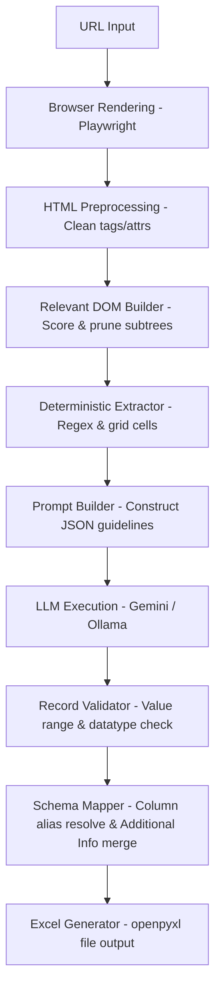

# Project Structure & Architecture Documentation

Welcome to the AI-Extractor project! This document outlines the repository layout, architectural components, pipeline data flow, and module responsibilities to help you get onboarded within a few minutes.

---

## 1. Directory Structure

```text
Ai-extractor/
├── core/                       # Core orchestration layer
│   ├── pipeline.py             # Orchestrates the generic data extraction stages
│   ├── prompt_builder.py       # Programmatic LLM prompt builder
│   ├── dom_builder.py          # Structured DOM parser (semantic block creation)
│   └── field_strategy.py       # Centralized Field Strategy Registry (Phase 5)
├── modules/                    # Reusable pipeline module components
│   ├── dataset_builder/        # Regex extraction, validators, schema mapping, and Excel writing
│   │   ├── deterministic_extractor.py  # Regex and structural grid/table parser
│   │   ├── record_validator.py         # Currency, numbers, phone validation and normalizer
│   │   ├── schema_mapper.py            # Alias lookup and Excel column mapping
│   │   └── builder.py                  # Workbook manager interfacing with openpyxl
│   ├── llm/                    # Large Language Model provider interfaces
│   │   ├── gemini_provider.py          # Google Gemini GenAI integration
│   │   └── ollama_provider.py          # Local model (Ollama API) integration
│   ├── relevant_dom/           # DOM pruning logic to reduce prompt token sizes
│   │   └── builder.py                  # HTML scoring and irrelevant subtree pruner
│   ├── evaluation/             # Pipeline runtime quality checking
│   │   ├── quality_evaluator.py        # Validates extraction metrics (hallucinations, coverage)
│   │   └── dom_checker.py              # Cross-references extracted fields against DOM text
│   ├── browser.py              # Playwright browser integration for rendered HTML fetches
│   ├── preprocessor.py         # HTML tag unwrapping, attribute removal, and clean-up
│   └── semantic_chunker/       # Text chunking utils
├── adapters/                   # Adapters mapping specific target web portals
│   └── franchise_bazar/        # Configs and column structures for franchisebazar.com
├── schemas/                    # Pydantic schemas and base models for adapters
│   └── schema_aliases.json     # Custom name alias overrides for canonical properties
├── app/                        # Streamlit web interface and backend API
│   ├── app.py                  # Streamlit graphical user interface (GUI)
│   └── main.py                 # FastAPI backend server
├── tests/                      # Python pytest automated testing files
├── tools/                      # Script utilities for data handling
├── logs/                       # System and extractor runtime logging output
├── debug/                      # Temp directories saving pipeline run intermediates (JSON/HTML)
├── archive/                    # Archived scratch code and obsolete components
│   ├── benchmark/              # Archived old benchmark framework (runner, comparator)
│   ├── scratch/                # Archived developer scratch helper scripts
│   ├── examples/               # Archived strategy script examples
│   ├── pipeline_outputs/       # Archived pipeline output dumps
│   ├── recovered/              # Archived recovered auto-saved scripts
│   └── root_scripts/           # Archived legacy testing scripts from root folder
├── .env.example                # Example configuration values template
├── requirements.txt            # Project third-party dependencies list
└── README.md                   # Getting started and setup guide
```

---

## 2. Pipeline Extraction Flow

When a URL extraction run is triggered, the pipeline processes the data through the following stages:



1.  **Rendering**: Playwright launches a headless browser, resolves dynamic client-side JS content, and fetches the fully rendered DOM.
2.  **Preprocessing**: Strips scripts, styles, custom properties, and tags to yield a clean base HTML.
3.  **DOM Pruning**: Section-by-section scoring keeps core text grids, contacts, and info segments, dropping layout bloat to fit token limitations.
4.  **Deterministic Regex matching**: Rapidly resolves specific known targets (phone numbers, emails, socials, structured tables) to reduce LLM load.
5.  **Prompt Construction**: Dynamically partitions remaining semantic/hybrid fields to request from the LLM.
6.  **LLM Execution**: Transmits the prompt instructions and DOM semantic blocks to Gemini or Ollama.
7.  **Record Validation**: Evaluates type definitions, cleans values, normalizes currency labels, and filters out false positive inputs.
8.  **Schema Mapping**: Maps properties to matching spreadsheet columns, placing any non-mapped fields into the `Additional Information` JSON block.
9.  **Workbook Management**: Appends the cleaned, mapped record row into the target Excel dataset.

---

## 3. Core Active Production Modules

*   **`core/field_strategy.py`**: The single source of truth defining how every field in the schema behaves. Sets extraction owner (`llm`/`deterministic`/`hybrid`) and merging rules (`deterministic_first`, `llm_only`).
*   **`modules/relevant_dom/builder.py`**: Scores subtrees based on keyword presence to isolate target business sections.
*   **`modules/dataset_builder/deterministic_extractor.py`**: Leverages layout pair and table cell detection to match keys directly against sibling values.
*   **`modules/dataset_builder/record_validator.py`**: Normalizes number formatting, units, dates, and phone numbers.
*   **`modules/dataset_builder/schema_mapper.py`**: Uses custom alias rules to reconcile field name overlaps during spreadsheet conversion.

---

## 4. Archived Components (`archive/`)

*   `benchmark/`: Contains the original performance evaluation framework (comparator, runner). This was archived as it was based on partially correct data and is replaced by dynamic test assertions.
*   `scratch/`: Developer scratch experiments and prompt token length analysis scripts.
*   `recovered/`: Auto-saved recovery scripts generated during code iterations.
*   `root_scripts/`: Early debugging scripts (`test_extractor.py`) and result dumps removed from the active workspace.
