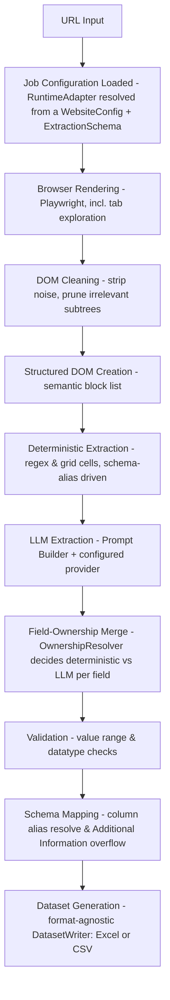
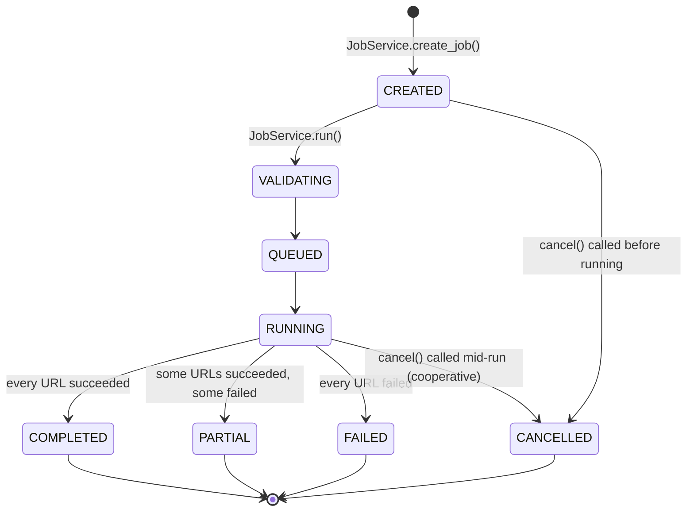

# Project Structure & Architecture Documentation

Welcome to the AI-Extractor project! This document outlines the repository layout, architectural components, pipeline data flow, and module responsibilities to help you get onboarded within a few minutes.

**Status:** this reflects the codebase after Milestone 1 (franchise-specific logic removed from the core pipeline, `adapters/` renamed to `templates/`, `config/` package introduced), Milestone 2 (`ConfigStore`/`SchemaStore`/`JobStore`, file-backed under `storage/`), and Milestone 2.5 (the `services/` layer, the explicit job lifecycle, structured validation errors, and `ExecutionContext`). The UI rebuild is the next milestone — see `docs/ARCHITECTURE_REDESIGN.md` for the full forward-looking blueprint and phased plan.

---

## 1. Directory Structure

```text
Ai-extractor/
├── core/                       # Core orchestration layer
│   ├── pipeline.py             # ExtractionPipeline - orchestrates the generic extraction stages
│   ├── pipeline_context.py     # PipelineContext - carries stage/log/metrics state through one URL's run
│   ├── execution_context.py    # ExecutionContext - the single, immutable job+adapter binding for a run (see §5)
│   ├── runtime_adapter.py      # RuntimeAdapter - built from a WebsiteConfig + ExtractionSchema
│   ├── ownership.py            # OwnershipResolver - field ownership/merge decisions
│   ├── job_executor.py         # execute_job() - runs every URL in a job through the pipeline
│   ├── prompt_builder.py       # Programmatic LLM prompt builder
│   ├── dom_builder.py          # Structured DOM parser (semantic block creation)
│   └── field_strategy.py       # FIELD_STRATEGY table - the generic default OwnershipResolver falls back to
├── config/                     # Runtime input data models + file-backed persistence
│   ├── website_config.py       # WebsiteConfig - rendering/cleaning/pruning rules, self-validating
│   ├── extraction_schema.py    # ExtractionField / ExtractionSchema - what to extract, into which columns, self-validating
│   ├── extraction_job.py       # ExtractionJob - one batch-of-URLs run against one config+schema; owns the lifecycle enum
│   ├── job_status.py           # JobStatus - the explicit job lifecycle (see §6)
│   ├── errors.py               # ValidationError - raised by WebsiteConfig/ExtractionSchema/ExtractionJob.validate()
│   ├── config_store.py         # ConfigStore - save/load/list/delete WebsiteConfig (one JSON file per record)
│   ├── schema_store.py         # SchemaStore - same, for ExtractionSchema
│   ├── job_store.py            # JobStore - same, for ExtractionJob (job history)
│   ├── _file_store.py          # JsonFileStore - shared CRUD base the three stores above sit on
│   └── _util.py                # slugify() - shared id/filename helper
├── services/                   # The stable boundary a UI (or any caller) is meant to use - never the stores directly
│   ├── config_service.py       # ConfigService - create/get/update/delete/list, + duplicate-name detection
│   ├── schema_service.py       # SchemaService - same, for ExtractionSchema
│   ├── job_service.py          # JobService - create_job/run/cancel/rerun/list/get, + the job lifecycle + cancellation
│   └── errors.py               # NotFoundError, DuplicateNameError, JobLifecycleError
├── modules/                    # Reusable pipeline module components
│   ├── dataset_builder/        # Deterministic extraction, validators, schema mapping, and format-agnostic dataset writing
│   │   ├── deterministic_extractor.py  # Regex/structural grid/table parser (schema-alias driven; CONCEPT_REGISTRY kept as a documented legacy fallback vocabulary - see file header)
│   │   ├── record_validator.py         # Generic core validation; delegates formatting to modules/validation/formatters.py
│   │   ├── schema_mapper.py            # Alias lookup and column mapping (format-agnostic - columns, not Excel-specific)
│   │   ├── schema_loader.py            # Load -> Validate -> Build Dynamic Model (build_model() has no franchise base class); also the legacy page-type -> schemas/*.json router
│   │   ├── generic_record.py           # GenericExtractionRecord - the minimal universal core build_model() attaches schema fields to
│   │   ├── manager.py                  # Backward-compat re-export shim -> writers/excel_writer.py
│   │   └── builder.py                  # DatasetBuilder: resolves the schema + one normalized record per URL, then hands both to a writers.DatasetWriter (Excel or CSV - see writers/)
│   ├── validation/              # Optional, opt-in value formatters
│   │   └── formatters.py               # Currency/area/hours/phone normalizers (extracted out of record_validator.py)
│   ├── llm/                    # Large Language Model provider interfaces
│   │   ├── gemini_provider.py          # Google Gemini GenAI integration
│   │   └── ollama_provider.py          # Local model (Ollama API) integration
│   ├── relevant_dom/           # DOM pruning logic to reduce prompt token sizes
│   │   └── builder.py                  # HTML scoring and irrelevant subtree pruner
│   ├── domain_profiles/        # DomainProfile dataclass + loader (pure pruning-rule data)
│   ├── browser.py              # Playwright browser integration for rendered HTML fetches
│   ├── preprocessor.py         # HTML tag unwrapping, attribute removal, clean-up, and page-type detection
│   ├── gemini.py                # Thin "call the configured LLM provider" wrapper - no orchestration (see note below)
│   ├── merger/                 # Legacy, unused - built for an abandoned multi-chunk extraction strategy
│   └── semantic_chunker/       # Legacy, unused - same abandoned strategy
├── writers/                     # Format-agnostic dataset output layer
│   ├── dataset_writer.py               # DatasetWriter interface + create_writer() factory (output_format: "excel" | "csv")
│   ├── excel_writer.py                 # ExcelDatasetWriter + the moved WorkbookManager/ExcelWriter/DuplicateDetector (openpyxl)
│   └── csv_writer.py                   # CSVDatasetWriter (stdlib csv module, UTF-8, append-only)
├── templates/                   # Starter WebsiteConfig + ExtractionSchema pairs, one folder per site (renamed from adapters/)
│   ├── default/                #   Fallback template used when no domain matches
│   ├── franchise_bazar/        #   config.json + schema.json for franchisebazar.com
│   └── ...                     #   franchise_india/, franchise_mart/, indiamart/
├── storage/                     # Runtime data for ConfigStore/SchemaStore/JobStore - gitignored, never code
│   ├── configs/*.json          #   Saved WebsiteConfig records
│   ├── schemas/*.json          #   Saved ExtractionSchema records
│   └── jobs/*.json             #   Saved ExtractionJob records (history)
├── schemas/                    # Legacy page-type schemas (franchise/company/product/blog/...) - optional fallback only, not a mandatory runtime dependency
│   └── schema_aliases.json     # Custom name alias overrides for canonical properties
├── app/                        # Streamlit web interface and backend API
│   ├── app.py                  # Streamlit graphical user interface (GUI) - uses core.pipeline.ExtractionPipeline directly (not yet migrated to services/ - see docs/ARCHITECTURE_REDESIGN.md)
│   └── main.py                 # FastAPI backend server - also uses core.pipeline.ExtractionPipeline (same execution path as the UI)
├── tests/                      # Python pytest automated testing files
├── logs/                       # System and extractor runtime logging output
├── debug/                      # Temp directories saving pipeline run intermediates (JSON/HTML)
├── archive/                    # Archived scratch code and obsolete components (evaluation framework, old benchmarks)
├── scratch/                    # Developer one-off debugging scripts, not part of the package
├── docs/
│   ├── PROJECT_STRUCTURE.md    # This document - current-state reference
│   └── ARCHITECTURE_REDESIGN.md # Forward-looking blueprint: Extraction Profiles, versioning, UI rebuild
├── .env.example                # Example configuration values template
├── requirements.txt            # Project third-party dependencies list
└── README.md                   # Getting started and setup guide
```

**Note on `modules/gemini.py`:** this module used to independently re-implement the full clean → prune → deterministic → LLM → merge → validate sequence (a second copy of what `core/pipeline.py` does), which meant a URL could produce different results depending on whether it was served by the Streamlit UI or the FastAPI endpoint. It is now a thin function that calls the configured LLM provider (Gemini or Ollama) and nothing else — `core/pipeline.py` is the single orchestration path for both entry points.

**Note on `app/app.py`/`app/main.py`:** neither has been migrated onto `services/` yet — they still call `core.pipeline.ExtractionPipeline` directly, the way they did before the service layer existed. That migration is expected to happen alongside the UI rebuild (Milestone 3), not before — see `docs/ARCHITECTURE_REDESIGN.md`.

---

## 2. Pipeline Extraction Flow (one URL)

When a URL extraction run is triggered, `core.pipeline.ExtractionPipeline.run()` processes the data through the following stages:



1.  **Job Configuration Loaded**: Resolves a `RuntimeAdapter` for this run. When called via `JobService`/`execute_job()` (see §5), this is handed down through an `ExecutionContext`, already built once - the pipeline never re-resolves it itself in that path. When called directly with no `ExecutionContext`/`RuntimeAdapter` (e.g. `app/main.py`, `app/app.py` today), one is resolved by matching the URL's domain against `templates/` via `AdapterLoader`. Page-type detection (step 3) is purely informational and never affects which schema is used.
2.  **Browser Rendering**: Playwright launches a headless browser, resolves dynamic client-side JS content, clicks/merges tabs, and fetches the fully rendered DOM.
3.  **DOM Cleaning**: Strips scripts, styles, and noise tags per the resolved `WebsiteConfig`; also runs `detect_page_type()` and attaches the result (e.g. "Product Page", confidence %) to the run as informational metadata.
4.  **Structured DOM Creation / DOM Pruning**: `RelevantDOMBuilder` scores and prunes subtrees, and `DOMBlockBuilder` converts the surviving HTML into a compact block list.
5.  **Deterministic Extraction**: Resolves fields the active `ExtractionSchema` declares aliases for (plus a documented legacy fallback vocabulary — see `deterministic_extractor.py`'s module docstring) directly from tables/lists/JSON-LD, without using LLM tokens.
6.  **LLM Extraction**: `ExtractionPromptBuilder` builds a prompt naming only the schema's *unsolved* fields; the configured LLM provider (Gemini or Ollama) is called once, validated against a dynamic model built purely from the active schema (`SchemaLoader.build_model()` — no inherited franchise fields).
7.  **Field-Ownership Merge**: For every field the active schema declares, `OwnershipResolver.merge()` decides whether the deterministic value, the LLM value, or neither wins, based on the field's own `extraction_owner`/`merge_policy` (if set) or the generic default in `core/field_strategy.py`.
8.  **Record Validation**: Evaluates type definitions, cleans values, normalizes currency/phone/area labels via `modules/validation/formatters.py`, and filters out false positive inputs.
9.  **Schema Mapping**: Maps properties to matching spreadsheet columns, placing any non-mapped fields into the `Additional Information` JSON block.
10. **Dataset Generation**: Appends the cleaned, mapped record row into the target dataset via `DatasetBuilder`, using the *same* schema this run already resolved (passed explicitly - see §5) rather than re-deriving one from the URL. `DatasetBuilder` itself never knows the output format - it resolves the schema and the one normalized record per URL, then hands both to a `writers.DatasetWriter` (`ExcelDatasetWriter` or `CSVDatasetWriter`, chosen via `output_format`/the `OUTPUT_FORMAT` env var - see `writers/dataset_writer.py`).

A field an `ExtractionSchema` doesn't declare simply doesn't exist on the dynamic model for that run — it's structurally impossible for it to be merged, validated, or mapped, regardless of what's on the page or what the LLM returns. See `tests/test_schema_field_omission.py` for the end-to-end guarantee.

---

## 3. Core Active Production Modules

*   **`core/pipeline.py`** (`ExtractionPipeline`): The single execution path for a URL — no duplicate orchestration exists elsewhere.
*   **`core/execution_context.py`** (`ExecutionContext`): The single, immutable job+adapter binding a job's execution is built around — see §5.
*   **`core/runtime_adapter.py`** (`RuntimeAdapter`): Same interface as the legacy `Adapter` (`.config`, `.schema`, `.get_profile()`, `.get_model()`), built in-memory from a `WebsiteConfig` + `ExtractionSchema` instead of read from a scanned folder.
*   **`core/ownership.py`** (`OwnershipResolver`): Resolves per-field deterministic-vs-LLM ownership and applies the merge. Falls back to `core/field_strategy.py`'s `FIELD_STRATEGY` table when a field doesn't declare its own `extraction_owner`/`merge_policy`.
*   **`modules/dataset_builder/schema_loader.py`** (`SchemaLoader.build_model()`): Builds the dynamic Pydantic model for a run's schema — only the fields that schema declares, plus the small universal core in `generic_record.py`.
*   **`modules/relevant_dom/builder.py`**: Scores subtrees based on keyword presence to isolate target business sections.
*   **`modules/dataset_builder/deterministic_extractor.py`**: Layout/table-cell key-value parser, schema-alias driven.
*   **`modules/dataset_builder/record_validator.py`** + **`modules/validation/formatters.py`**: Generic validation core plus optional currency/phone/area/hours normalizers.
*   **`modules/dataset_builder/schema_mapper.py`**: Uses alias rules to reconcile field name overlaps during spreadsheet conversion.
*   **`services/job_service.py`** (`JobService`): Owns the job lifecycle and cooperative cancellation — see §5/§6.

---

## 4. Validation & Error Model

Every one of the three runtime input models is self-validating: `WebsiteConfig`, `ExtractionField`/`ExtractionSchema`, and `ExtractionJob` each run their own `validate()` from `__post_init__`, so a malformed object cannot be constructed at all — it fails immediately, at the point of creation, with a message naming exactly which field is wrong (`config/errors.py: ValidationError`, a `ValueError` subclass). This replaced letting a bad value surface later as a raw `KeyError`/`TypeError` deep inside whatever first tried to use it (e.g. `browser.py` reading a missing `browser_config` key).

Two more error types exist at the service layer (`services/errors.py`), since they need information a single model's own `validate()` can't have:

*   **`NotFoundError`** (`KeyError` subclass) — raised by `ConfigService`/`SchemaService`/`JobService` when asked for an id that isn't in the store. `ConfigStore`/`SchemaStore`/`JobStore` themselves still raise a plain `KeyError`; the service layer is what translates that into a named, catchable type.
*   **`DuplicateNameError`** (`ValueError` subclass) — raised by `ConfigService.create()`/`SchemaService.create()` when a new record's name (case-insensitively) collides with an already-saved one. This is a business rule, not something `WebsiteConfig.validate()` could check by itself (a single object doesn't know what else is in the store).
*   **`JobLifecycleError`** (`ValueError` subclass) — raised by `JobService.run()` when asked to run a job that's already `RUNNING` or already terminal (see §6). `cancel()` deliberately does *not* raise this for an already-terminal job — cancelling something that's already finished is treated as a no-op, not an error.

**Rule of thumb:** a store only ever raises a bare `KeyError` (missing file) or lets a model's own `ValidationError` propagate (bad data). A service always raises one of its own named error types instead - nothing above the store layer should ever need to catch a bare `KeyError`/`ValueError` and guess what it means.

---

## 5. Job Execution Flow: `JobService` → `ExecutionContext` → `RuntimeAdapter` → `ExtractionPipeline`

```mermaid
sequenceDiagram
    participant Caller as Caller (future UI / script / test)
    participant JS as JobService
    participant Stores as ConfigStore / SchemaStore / JobStore
    participant EC as ExecutionContext
    participant JE as execute_job()
    participant Pipe as ExtractionPipeline (per URL)

    Caller->>JS: create_job(name, urls, config_id, schema_id)
    JS->>Stores: load WebsiteConfig, load ExtractionSchema
    JS->>Stores: save new ExtractionJob (status=CREATED)
    JS-->>Caller: ExtractionJob

    Caller->>JS: run(job_id)
    JS->>Stores: load ExtractionJob
    JS->>JS: mark_validating() -> save; validate config+schema
    JS->>JS: mark_queued() -> save
    JS->>EC: build ONE RuntimeAdapter, then ONE ExecutionContext(job, runtime_adapter)
    JS->>JE: execute_job(execution_context, cancel_event, ...)

    loop for each URL in job.urls
        JE->>EC: execution_context.for_url(url) -> new ExecutionContext,<br/>SAME job/runtime_adapter, fresh PipelineContext
        JE->>Pipe: pipeline.run(url, execution_context=...)
        Pipe-->>JE: {status, mapped_record, save_info, ...}
        JE->>JS: job.add_url_result(url, outcome)
    end

    JE->>JS: job.mark_completed() / mark_partial() / mark_failed() / mark_cancelled()
    JS->>Stores: save final ExtractionJob
    JS-->>Caller: ExtractionJob
```

**Why `ExecutionContext` exists:** before it, `execute_job()` built its own `RuntimeAdapter` internally, and the pipeline's Excel-writing stage separately re-resolved a schema from the URL via `AdapterLoader` - two different, independent ways to arrive at "the schema for this run," which could (and, per `tests/test_end_to_end_workflow.py`, did) disagree for any job whose URL didn't happen to match a `templates/` domain. `ExecutionContext` is now the single place a job's `RuntimeAdapter` gets built (inside `JobService.run()`), and every lower layer receives that same object - `execute_job()`, `ExtractionPipeline.run()`, and (for the one remaining call that still needs an explicit schema, the Excel-writing stage) all read from it rather than re-deriving anything. `ExecutionContext.website_config`/`.extraction_schema` are read-only properties over `.runtime_adapter`, not separately-stored fields, so they can never drift out of sync with it. `ExecutionContext.for_url(url)` returns a *new* `ExecutionContext` (the object is frozen/immutable) carrying a fresh, URL-scoped `PipelineContext`, but the exact same `job`/`runtime_adapter` references - see `tests/test_execution_context.py` for the identity guarantee this provides. It is also deliberately extensible: a tracing id, auth/user identity, or a quota budget can be added as a new field on `ExecutionContext` later without changing every method signature between `JobService` and `ExtractionPipeline`.

**Direct pipeline callers** (`app/app.py`, `app/main.py`, and most pipeline-level tests) don't go through `JobService`/`ExecutionContext` at all yet - they call `ExtractionPipeline.run(url, runtime_adapter=...)` directly, which still works exactly as before. `ExecutionContext` is additive, not a breaking change to the pipeline's public interface.

---

## 6. Job Lifecycle



Defined in `config/job_status.py`. `CREATED`/`VALIDATING`/`QUEUED` aren't meaningfully different from each other today (there's no real queue or background worker yet - `JobService.run()` moves through them essentially immediately), but they exist now so that adding one later (background workers, retries, multiple workers) doesn't require changing the `ExtractionJob` model, only how a transition gets triggered.

`PARTIAL` is not one of the states originally proposed - it was added because a batch job's URLs don't have a binary outcome: some can succeed while others fail, and that's a materially different, actionable result from "everything failed." Overloading `FAILED` or `COMPLETED` to mean "well, some of it worked" would have thrown away information a caller (or a future UI) needs.

**Cancellation is cooperative, not preemptive.** `JobService.cancel(job_id)`:
- For a job that hasn't started running yet (`CREATED`/`VALIDATING`/`QUEUED`): marks it `CANCELLED` immediately.
- For a `RUNNING` job: sets an `asyncio.Event` that `execute_job()` checks before starting each URL (and again right after acquiring its concurrency slot). A URL already mid-render or mid-LLM-call when cancellation is requested still runs to completion; any URL not yet started is skipped and recorded as `"cancelled"` in the job's `stage_log`. See `tests/test_services.py::test_job_service_cancel_while_running_stops_remaining_urls` for the exact boundary this produces.
- For an already-terminal job (`COMPLETED`/`FAILED`/`CANCELLED`/`PARTIAL`): a no-op, returning the job unchanged - not an error.

---

## 7. Responsibility Boundaries: Stores vs. Services vs. Pipeline

| Layer | Owns | Never does |
|---|---|---|
| **Stores** (`config/*_store.py`) | Reading/writing one JSON file per record under `storage/`; raising a bare `KeyError` if a record doesn't exist. | Validation (the model already validated itself before the store ever saw it), business rules (duplicate names, lifecycle), or anything domain-specific. |
| **Services** (`services/*_service.py`) | The only thing a caller (future UI, script, another service) should touch: coercing raw input into a validated model, duplicate-name detection, translating store `KeyError`s into `NotFoundError`, and - `JobService` only - the job lifecycle and cancellation. | Talking to `openpyxl`/Playwright/an LLM provider directly, or knowing that storage is currently JSON files (that's the store's business). |
| **`core/` orchestration** (`ExtractionPipeline`, `execute_job`, `ExecutionContext`, `RuntimeAdapter`, `OwnershipResolver`) | Actually running an extraction: rendering, cleaning, extracting, merging, validating, mapping, writing output - for one URL (`ExtractionPipeline`) or a job's worth of URLs (`execute_job`). | Persistence (it receives a `RuntimeAdapter`/`ExecutionContext` already built; it never loads a `WebsiteConfig`/`ExtractionSchema` from a store itself), and it never independently re-derives a schema/config it was already handed (see §5's `ExecutionContext` rationale). |

A caller should never need to import `config.config_store`, `config.schema_store`, or `config.job_store` directly - only `services.config_service.ConfigService`, `services.schema_service.SchemaService`, and `services.job_service.JobService`.

---

## 8. Archived / Legacy Components

*   **`archive/`**: Retired evaluation framework and old benchmark tooling. Not imported by any active code path.
*   **`modules/merger/`, `modules/semantic_chunker/`**: Unused, built for a hierarchical multi-chunk extraction strategy the pipeline no longer uses (it always makes exactly one LLM request per URL). Referenced only by their own tests.
*   **`modules/dataset_builder/schema_loader.py`'s `load_schema()`**: The legacy page-type → `schemas/*.json` router. Kept as an optional "suggest a starting schema" helper; not used to select a schema during a real pipeline run (the schema is always whatever the caller's `RuntimeAdapter`/`ExecutionContext` was built with).
*   **`scratch/`**: Developer one-off debugging scripts, not part of the shipped package.
